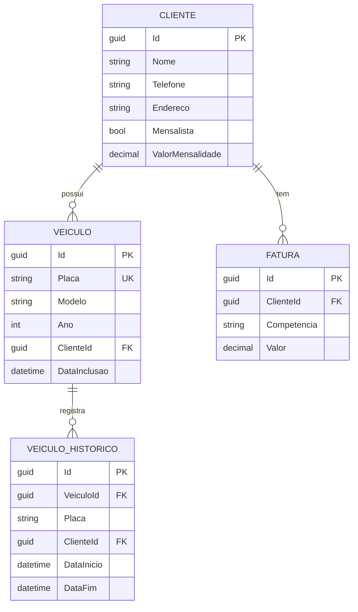

# 🚗 Sistema de Gestão de Estacionamento

Sistema completo de gestão de estacionamento com controle de clientes, veículos e faturamento proporcional de mensalidades.

## 📋 Índice

- [Tecnologias Utilizadas](#-tecnologias-utilizadas)
- [Funcionalidades](#-funcionalidades)
- [Arquitetura e Decisões Técnicas](#-arquitetura-e-decisões-técnicas)
- [Configuração e Execução](#-configuração-e-execução)
- [Estrutura do Projeto](#-estrutura-do-projeto)
- [API Endpoints](#-api-endpoints)

## 🛠 Tecnologias Utilizadas

### Backend
- **.NET 8** - Framework principal
- **Entity Framework Core** - ORM para acesso ao banco
- **PostgreSQL** - Banco de dados relacional
- **ASP.NET Core Web API** - API RESTful

### Frontend
- **React 18** - Biblioteca UI
- **Vite** - Build tool e dev server
- **TanStack Query (React Query)** - Gerenciamento de estado server
- **CSS Modules** - Estilização

## ✨ Funcionalidades

### 1. Gestão de Clientes
- ✅ Cadastro, edição e exclusão de clientes
- ✅ Busca em tempo real (case-insensitive)
- ✅ Filtro por tipo (mensalista/não-mensalista)
- ✅ Validação de campos obrigatórios (nome, telefone)
- ✅ Garantia de unicidade (nome + telefone)
- ✅ Proteção: não exclui clientes com faturas

### 2. Gestão de Veículos
- ✅ Cadastro com validação de formato de placa (ABC-1234 ou ABC1D23)
- ✅ Associação a clientes com histórico de transferências
- ✅ Edição e transferência entre clientes
- ✅ Exclusão automática de veículos ao excluir cliente

### 3. Faturamento
- ✅ Geração automática de faturas mensais
- ✅ **Faturamento proporcional** baseado em dias de vigência
- ✅ Histórico de posse de veículos por cliente
- ✅ Visualização detalhada com placas dos veículos

### 4. Importação CSV
- ✅ Upload e processamento em lote
- ✅ Relatório detalhado de erros por linha
- ✅ Validações: formato, campos obrigatórios, duplicatas
- ✅ Feedback visual (sucessos, erros, avisos)

## 🏗 Arquitetura e Decisões Técnicas

### 1. Faturamento Proporcional

**Problema:** Calcular faturas quando veículos trocam de cliente no meio do mês.

**Solução:** Tabela de histórico `VeiculoHistorico` que registra:
- Data início e fim de cada período
- Cliente associado no período
- Placa do veículo

**Cálculo:**
```csharp
valorProporcional = (valorMensalidade / diasNoMes) * diasAtivos
```

**Exemplo:**
- Mensalidade: R$ 300,00
- Veículo do Cliente A: 01/10 a 10/10 (10 dias)
- Mês de outubro: 31 dias
- Fatura: (300 / 31) * 10 = **R$ 96,77**

**Por que não usar migrations?**
- Flexibilidade para ajustes futuros
- Histórico mantido em tabela separada
- Não requer alteração no modelo `Veiculo` existente

### 2. Validação de Duplicatas

**Cliente:** Combinação única de `Nome + Telefone`
- Previne cadastros duplicados
- Permite clientes com mesmo nome mas telefones diferentes

**Veículo:** Placa única no sistema
- Validação no backend (banco) e frontend (UX)
- Formatos aceitos: ABC-1234 (antigo) e ABC1D23 (Mercosul)

### 3. Busca em Tempo Real

**Implementação:** Debounce de 300ms
```javascript
useEffect(() => {
  const timer = setTimeout(() => {
    setDebouncedFiltro(filtro)
  }, 300)
  return () => clearTimeout(timer)
}, [filtro])
```

**Benefícios:**
- Reduz requisições ao servidor
- Melhora performance
- UX fluida

### 4. Importação CSV

**Estratégia:** Processamento linha a linha com relatório detalhado

**Validações por linha:**
- Formato de arquivo e colunas
- Campos obrigatórios (nome, telefone, placa)
- Tipos de dados (decimal, int, boolean)
- Duplicatas (placa já existente)

**Feedback:**
- Status: sucesso ✅, erro ❌, aviso ⚠️
- Mensagem descritiva do problema
- Dados da linha processada
- Estatísticas: total, sucessos, erros

### 5. Proteção de Integridade

**Exclusão em cascata:**
```csharp
// Ao excluir cliente, remove veículos associados
var veiculos = _db.Veiculos.Where(v => v.ClienteId == id);
_db.Veiculos.RemoveRange(veiculos);
```

**Proteção contra exclusão:**
```csharp
// Bloqueia exclusão de cliente com faturas
var temFaturas = await _db.Faturas.AnyAsync(f => f.ClienteId == id);
if (temFaturas)
    return BadRequest("Não é possível excluir clientes que possuam faturas.");
```

### 6. Gerenciamento de Estado (Frontend)

**TanStack Query:** Cache inteligente e sincronização
```javascript
const clientes = useQuery({
  queryKey: ['clientes', filtro, mensalista],
  queryFn: () => apiGet(`/api/clientes?filtro=${filtro}&mensalista=${mensalista}`)
})
```

**Benefícios:**
- Cache automático
- Refetch em background
- Invalidação granular
- Loading/error states

## 🚀 Configuração e Execução

### Pré-requisitos
- .NET 8 SDK
- PostgreSQL 12+
- Node.js 18+

### 1. Configurar Banco de Dados

```bash
# Criar banco
createdb parking_test

# Executar seed (opcional)
psql -h localhost -U postgres -d parking_test -f scripts/seed.sql
```

### 2. Configurar Backend

```bash
cd src/backend

# Restaurar dependências
dotnet restore

# Ajustar connection string em appsettings.json
{
  "ConnectionStrings": {
    "Default": "Host=localhost;Database=parking_test;Username=postgres;Password=sua_senha"
  }
}

# Executar migrations
dotnet ef database update

# Rodar aplicação
dotnet run
```

API disponível em: `http://localhost:5000`  
Swagger: `http://localhost:5000/swagger`

### 3. Configurar Frontend

```bash
cd src/frontend

# Instalar dependências
npm install

# Configurar URL da API (opcional)
# Criar arquivo .env
VITE_API_URL=http://localhost:5000

# Rodar aplicação
npm run dev
```

Frontend disponível em: `http://localhost:5173`

## 📁 Estrutura do Projeto

```
├── src/
│   ├── backend/
│   │   ├── Controllers/
│   │   │   ├── ClientesController.cs
│   │   │   ├── VeiculosController.cs
│   │   │   ├── FaturasController.cs
│   │   │   └── ImportController.cs
│   │   ├── Services/
│   │   │   └── FaturamentoService.cs
│   │   ├── Models/
│   │   │   ├── Cliente.cs
│   │   │   ├── Veiculo.cs
│   │   │   ├── Fatura.cs
│   │   │   └── VeiculoHistorico.cs
│   │   ├── Data/
│   │   │   └── AppDbContext.cs
│   │   └── Program.cs
│   └── frontend/
│       ├── src/
│       │   ├── pages/
│       │   │   ├── ClientesPage.jsx
│       │   │   ├── VeiculosPage.jsx
│       │   │   ├── FaturamentoPage.jsx
│       │   │   └── CsvUploadPage.jsx
│       │   ├── api.js
│       │   └── main.jsx
│       └── package.json
└── scripts/
    ├── seed.sql
    └── exemplo.csv
```

## 🔌 API Endpoints

### Clientes
```
GET    /api/clientes?filtro={nome}&mensalista={all|true|false}
POST   /api/clientes
GET    /api/clientes/{id}
PUT    /api/clientes/{id}
DELETE /api/clientes/{id}
```

### Veículos
```
GET    /api/veiculos?clienteId={id}
POST   /api/veiculos
GET    /api/veiculos/{id}
PUT    /api/veiculos/{id}
DELETE /api/veiculos/{id}
```

### Faturas
```
GET    /api/faturas?competencia={yyyy-MM}
POST   /api/faturas/gerar { "competencia": "2025-08" }
GET    /api/faturas/{id}/placas
```

### Importação
```
POST   /api/import/csv (multipart/form-data)
```

**Formato CSV:**
```csv
nome,telefone,endereco,mensalista,valor_mensalidade,placa,modelo,ano
João Silva,11999999999,Rua A 123,sim,300.00,ABC-1234,Civic,2020
```

## 📊 Modelo de Dados



## 🧪 Testes

### Cenário: Faturamento Proporcional

1. Cliente A com mensalidade de R$ 300,00
2. Veículo cadastrado em 01/10
3. Veículo transferido para Cliente B em 11/10
4. Gerar faturas de outubro (31 dias)

**Resultado esperado:**
- Cliente A: (300 / 31) * 10 = R$ 96,77
- Cliente B: (300 / 31) * 21 = R$ 203,23

### Cenário: Importação CSV com Erros

```csv
nome,telefone,endereco,mensalista,valor_mensalidade,placa,modelo,ano
,11999999999,Rua A,sim,300.00,ABC1234,Civic,2020        # Erro: nome vazio
João,11999999999,Rua B,sim,abc,ABC1234,Civic,2020       # Erro: valor inválido
Maria,11888888888,Rua C,sim,250.00,ABC1234,Civic,2020   # Aviso: placa duplicada
```

## 🤝 Contribuindo

1. Fork o projeto
2. Crie uma branch para sua feature (`git checkout -b feature/nova-feature`)
3. Commit suas mudanças (`git commit -m 'Adiciona nova feature'`)
4. Push para a branch (`git push origin feature/nova-feature`)
5. Abra um Pull Request

## 📝 Licença

Este projeto está sob a licença MIT.

---

**Desenvolvido com ❤️ usando .NET 8 e React**
